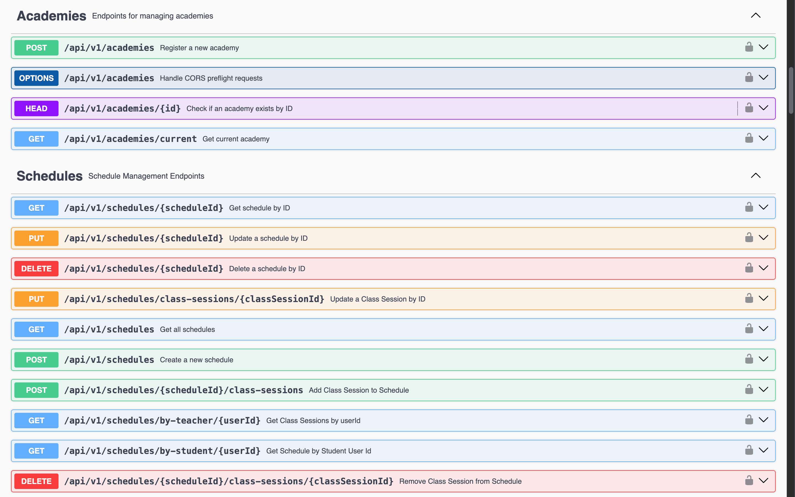
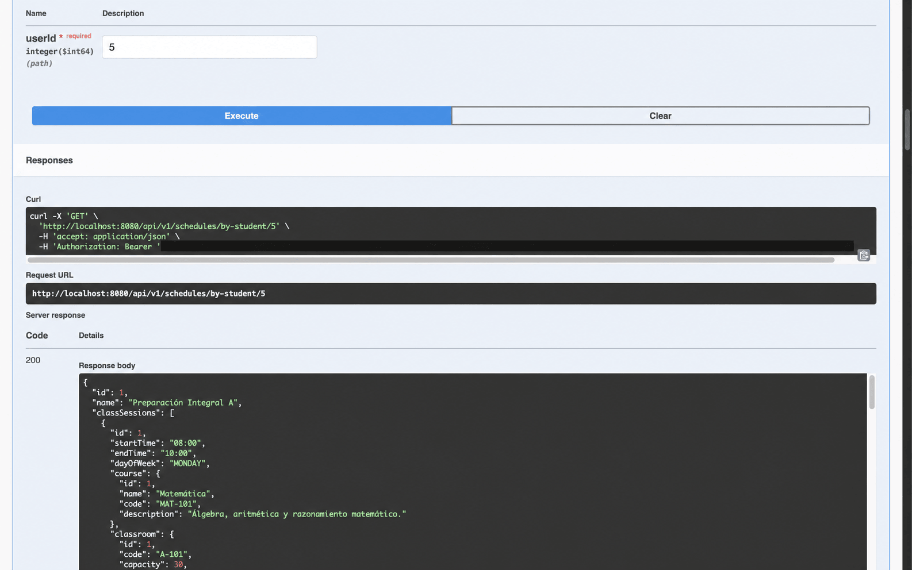

# Demy API

[English](./README.md) | [Español](./README.es.md)

  

La API REST que impulsa **Demy**, un producto multiplataforma para la gestión de academias creado por [Nistra](https://github.com/nistrahq). Centraliza identidad, instituciones, matrículas, horarios, asistencia, facturación y contabilidad para que las aplicaciones de administradores, docentes y estudiantes compartan una única fuente de información.

## Qué ofrece

- Autenticación con JWT, recuperación de cuenta y acceso según roles.
- Gestión de academias, docentes, estudiantes, cursos, aulas y periodos académicos.
- Flujos de matrículas y horarios para administradores, docentes y estudiantes.
- Registro y reportes de asistencia.
- Facturación, transacciones, resúmenes financieros y reportes PDF/Excel.
- Mensajes disponibles en inglés y español.
- Documentación OpenAPI 3 mediante Swagger UI.

## Arquitectura

El servicio usa **Java 21**, **Spring Boot**, **Spring Data JPA** y **MySQL**. Su estructura sigue Domain-Driven Design con estos bounded contexts:

```text
com.nistra.demy.platform
├── iam
├── institution
├── enrollment
├── scheduling
├── attendance
├── billing
├── accountingfinance
└── shared
```

Cada bounded context separa aplicación, dominio, infraestructura e interfaces. `shared` contiene infraestructura transversal y no representa un dominio de negocio.

## Vista previa de la API


<details>
<summary>Ver más capturas de la API</summary>

### Catálogo de endpoints



### Consulta del horario de un estudiante



</details>

## Ejecución local

### Requisitos

- JDK 21
- MySQL 8+
- Maven Wrapper incluido

Configura las variables usadas por `application.properties` y `application-dev.properties`, incluida la conexión a la base de datos, JWT, contacto de documentación y correo. Luego ejecuta:

```bash
SPRING_PROFILES_ACTIVE=dev ./mvnw spring-boot:run
```

Endpoints locales predeterminados:

- API: `http://localhost:8080/api/v1`
- Swagger UI: `http://localhost:8080/swagger-ui/index.html`
- Documento OpenAPI: `http://localhost:8080/v3/api-docs`

Swagger anuncia una URL de servidor relativa, por lo que las peticiones permanecen en el host que sirvió la documentación.

## Verificación

```bash
./mvnw test
./mvnw package
```

Las pruebas de integración requieren una configuración MySQL de pruebas válida.

## Ecosistema Demy

- [Landing page](https://github.com/nistrahq/demy-landing)
- [Aplicación de administradores](https://github.com/nistrahq/demy-admins)
- [Aplicación de docentes](https://github.com/nistrahq/demy-teachers)
- [Aplicación de estudiantes](https://github.com/nistrahq/demy-students)

Consulta [CONTRIBUTING.es.md](./CONTRIBUTING.es.md) para conocer el flujo Git y las convenciones de desarrollo.
